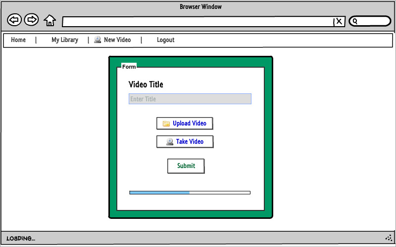
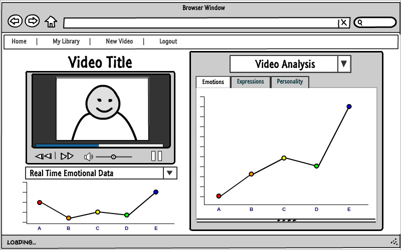
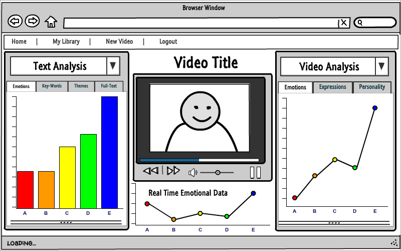
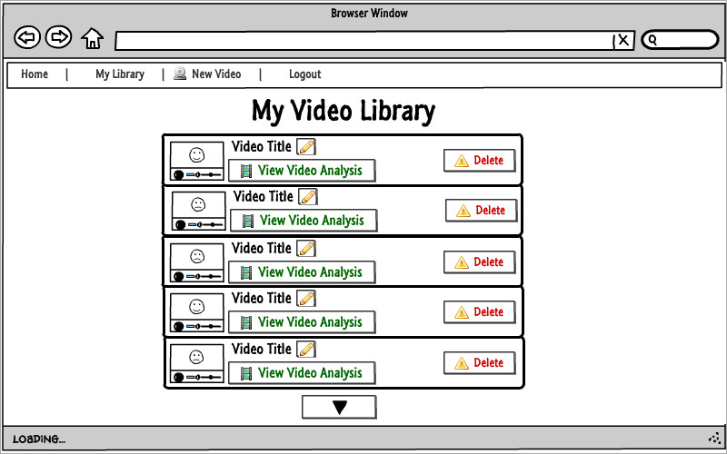
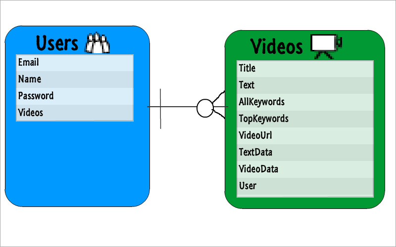

## Synopsis

How well can a computer understand human emotion? This website puts that question to the test. The website allows the user to upload/record a one minute video that gets analyzed for its emotional content. This gets saved to the users video library/profile so they can reference back to it later.

## Backup

Glassdoor

## Core Technologies Used

- Node.js
- MongoDB
- Mongoose
- Angular
- Materialize

## List of Packages and Repos

### ---Video Uploader----------------
#### - BinaryJs
- https://www.npmjs.com/package/binaryjs

### ---Video Parser-------------------
#### - ffmpeg
- https://www.npmjs.com/package/ffmpeg
- https://www.npmjs.com/package/fluent-ffmpeg

### ---Video Player-------------------
#### - video.js
- https://www.npmjs.com/package/video.js

### ---Text-Analysis------------------
#### - Alchemy Language Api
- http://www.alchemyapi.com/products/demo/alchemylanguage

### ---Video Emotional Analysis-----
#### - Emovu
- https://market.mashape.com/eyeris/emovu-1

### ---Video Recorder for User-------
- https://github.com/streamproc/MediaStreamRecorder

### ---Speech To Text----------------
- https://github.com/watson-developer-cloud/speech-to-text-nodejs

### ---Materialize Templates----------
- http://materializecss.com/collections.html#!
- http://materializecss.com/forms.html

### ---Charts/Data Analysis Views-----
#### uvCharts
- https://github.com/Imaginea/uvCharts/wiki/guide
- http://imaginea.github.io/uvCharts/index.html#features

## Motivation

I want to understand how an AI can develop emotional awareness.

## Wire Frames

### --- Sign Up/Log in ---

### --- Create Video ---

### --- View Video 1 ---

### --- View Video 2 ---

### --- User Profile ---

## Models

## Installation

Coming Soon...

## API Reference

Coming Soon...
